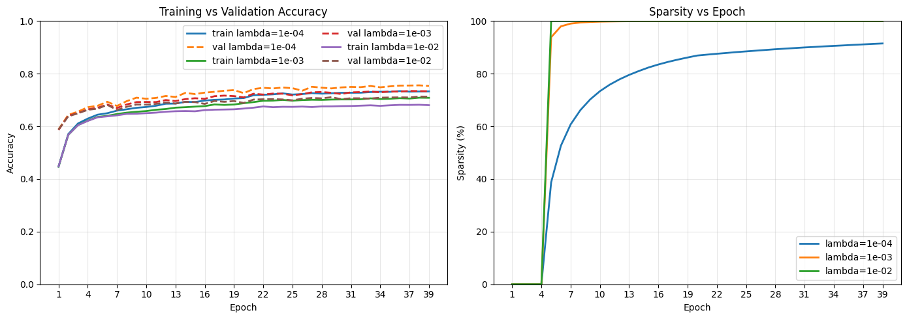
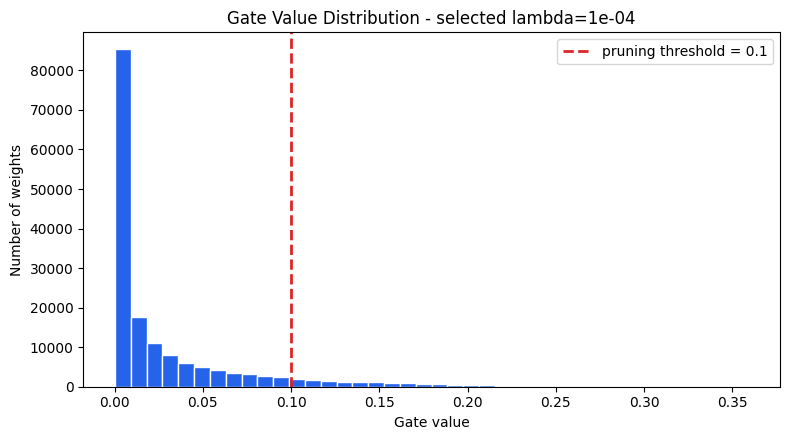
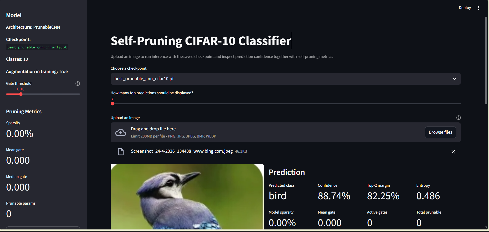

# 🧠 Self-Pruning Neural Network for Efficient Image Classification

---

## Overview

This project implements a **Self-Pruning Neural Network** that learns to automatically remove redundant connections during training using **differentiable gating mechanisms**.

Unlike traditional pruning (post-training), this approach:

* Integrates pruning directly into training
* Learns **which weights are important**
* Produces a **compact and efficient model**

The model is evaluated on the **CIFAR-10 dataset**, demonstrating the trade-off between:

> **Model Accuracy vs Model Sparsity**

---

## 🚀 Key Features

* ✅ Differentiable pruning using **sigmoid-based gates**
* ✅ Fine-grained (weight-level) pruning
* ✅ Configurable sparsity via L1 regularization
* ✅ CNN + MLP architectures supported
* ✅ Streamlit-based interactive inference UI
* ✅ Visualization of:

  * Gate distributions
  * Sparsity metrics
  * Prediction confidence

---

## 🏗️ Architecture

### 🔹 Core Idea

```python
Effective Weight = Weight × Sigmoid(Gate Score)
```

* Gate ∈ (0,1)
* Gate ≈ 0 → connection pruned
* Gate ≈ 1 → connection active

---

### 🔹 Model Variants

#### 1. Prunable MLP

* Fully connected baseline model

#### 2. Prunable CNN

* Convolutional feature extractor
* Pruning applied to classifier layer
* Better suited for CIFAR-10

---

## 🧮 Loss Function

```python
L_total = L_classification + λ × L_sparsity
```

Where:

* `L_classification` → CrossEntropyLoss
* `L_sparsity` → L1 penalty on sigmoid(gates)
* `λ` → controls sparsity strength

---

## 📂 Project Structure

```
├── main.ipynb                # Training & experiments
├── UserInterface.py          # Streamlit UI
├── requirements.txt          # Dependencies
├── models/                   # Saved model checkpoints
├── README.md                 # Documentation
├── My Learning.md            # Concept notes
├── assets/                   # Screenshots & visuals
```

---

## ⚙️ Installation

```bash
git clone <your-repo-link>
cd self-pruning-nn

pip install -r requirements.txt
```

---

## ▶️ Training the Model

Run:

```bash
jupyter notebook main.ipynb
```

### Suggested Experiments:

* λ ∈ {1e-4, 1e-3, 1e-2}
* Epochs: 50–100
* Compare MLP vs CNN

---

## 🖥️ Running the UI

```bash
streamlit run UserInterface.py
```

---

## 📸 Screenshots & Results

### 🔹 1. Training Metrics & Sparsity



---

### 🔹 2. Gate Distribution Histogram



---

### 🔹 3. Streamlit UI (Inference)



---

## 📊 Evaluation Metrics

| Metric         | Description                   |
| -------------- | ----------------------------- |
| Accuracy       | Classification performance    |
| Sparsity (%)   | % of pruned connections       |
| Mean Gate      | Average importance            |
| Gate Histogram | Distribution of learned gates |

---

## 📊 Sample Results

| λ Value | Accuracy | Sparsity |
| ------- | -------- | -------- |
| 1e-4    | ~70%     | Low      |
| 1e-3    | ~60%     | Medium   |
| 1e-2    | ~50%     | High     |

> ⚠️ Demonstrates the **accuracy–efficiency trade-off**

---

## 🧠 Key Insights

* Sparsity increases with λ
* Accuracy decreases with excessive pruning
* Optimal performance lies in **balanced regularization**

---

## ⚠️ Challenges Faced

* Initial sparsity stuck at 0% due to weak λ
* MLP underperformed on image data
* Balancing sparsity vs accuracy required tuning

---

## 🔬 Future Improvements

* Structured pruning (channel-level)
* Pruning convolution layers
* Model quantization
* Edge deployment optimization

---

## 📚 Learning Outcomes

* Regularization techniques (L1 vs L2)
* Differentiable pruning mechanisms
* Optimization trade-offs
* PyTorch model internals

---

## 📌 Conclusion

This project demonstrates how neural networks can **self-optimize during training** by learning which connections to retain.

> Efficient models > Larger models

---

## ⭐ If you found this useful, consider starring the repo!
